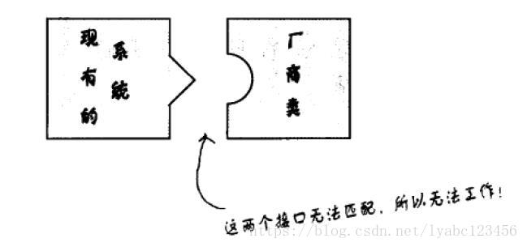
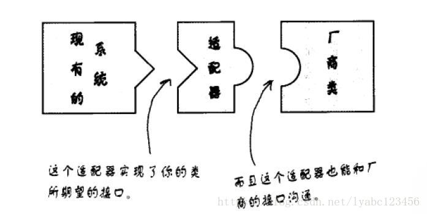
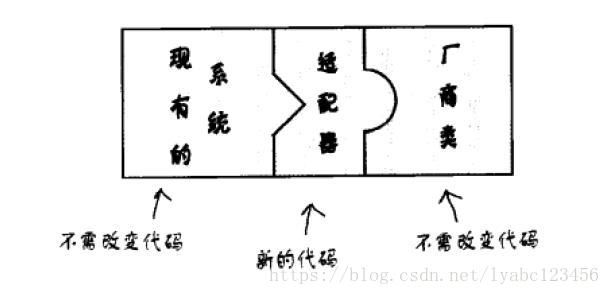

# 适配器模式

> - 什么是适配器模式
> - 具体如何实现
> - 应用场景都有哪些
> - 优点与缺点

## 适配器模式的生活实例

举个生活中的例子，我们想把内存卡中的数据导入到电脑中，但是电脑上没有能直接供内存卡插入的接口。此时，我们需要一个读卡器。将内存卡插入读卡器，再将读卡器插入电脑，这样就可以将内存卡中的数据导入到电脑中。在这个场景中，读卡器就是作为内存卡和电脑之间的适配器。

## 什么是适配器模式

> 适配器模式，就是将一个类的接口转换成我们所希望的另一个接口，从而使原本由于接口不兼容而不能一起工作的那些类可以一起工作。

现有系统和厂商类无法直接调用：

创建一个适配器：

加入适配器以后，一切都变得天衣无缝：

> 在不修改原有代码的基础上增加新的适配器类，完全符合“开闭原则”

## 具体如何实现

> 关键思想：适配器继承或依赖已有的对象，实现符合我们要求的目标接口。

## 应用场景都有哪些

> 应用场景：主要应用在软件系统中，常常要将一些"现存的对象"放到新的环境中，而新环境要求的接口是现对象不能满足的。

## 优点与缺点

优点： 

1、可以让任何两个没有关联的类一起工作。 

2、提高了类的复用。 

3、灵活性好。

缺点： 

1、过多地使用适配器，会让系统非常零乱，不易整体进行把握。比如，明明看到调用的是 A 接口，其实内部被适配成了 B 接口的实现，一个系统如果太多出现这种情况，无异于一场灾难。因此如果不是很有必要，可以不使用适配器，而是直接对系统进行重构。

2、由于 JAVA 至多继承一个类，所以至多只能适配一个适配者类，而且目标类必须是抽象类。

## 注意事项

适配器不是在详细设计时添加的，而是解决正在服役的项目的问题。