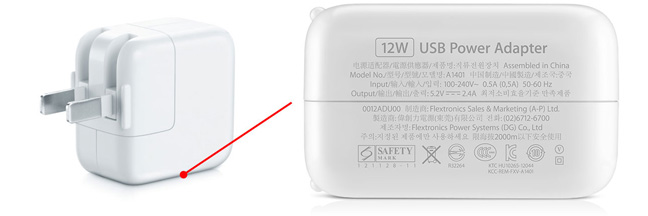

# 适配器模式

> - 什么是适配器模式
> - 具体如何实现
> - 应用场景都有哪些
> - 优点与缺点

## 适配器模式的生活实例

举个生活中的例子，苹果电脑需要的电压是5V，而电源提供的电压是220V。下图的电源适配器负责把电源的电压调整到电脑所需的电压值，以此实现电源与电脑正常工作。

## 什么是适配器模式

> 适配器模式，就是将一个类的接口转换成我们所希望的另一个接口，从而使原本由于接口不兼容而不能一起工作的那些类可以一起工作。

## 具体如何实现

 -- 主要角色 --

目标抽象类：目标抽象类定义客户所需接口，可以是一个抽象类或接口，也可以是具体类。

适配器类：适配器可以调用另一个接口，作为一个转换器，对适配者和目标类进行适配，适配器类是适配器模式的核心，在对象适配器中，它通过继承目标类并关联一个适配者对象使二者产生联系。

适配者类：适配者即被适配的角色，它定义了一个已经存在的接口，这个接口需要适配，适配者类一般是一个具体类，包含了客户希望使用的业务方法。

客户类：整个业务的发起者，调用者。

> 关键思想：适配器继承或依赖已有的对象，实现符合我们要求的目标接口。

## 应用场景都有哪些

> 应用场景：主要应用在软件系统中，常常要将一些"现存的对象"放到新的环境中，而新环境要求的接口是现对象不能直接满足的。

现有系统和厂商类无法直接调用：

创建一个适配器：

加入适配器以后，一切都变得天衣无缝：

> 在不修改原有代码的基础上增加新的适配器类，完全符合“开闭原则”

## 优点与缺点

优点： 

1、可以让任何两个没有关联的类一起工作。 

2、提高了类的复用。 

3、在不修改原有代码的基础上增加新的适配器类，完全符合“开闭原则”。

4、灵活性好。

缺点： 

1、过多地使用适配器，会让系统非常零乱，不易整体进行把握。比如，明明看到调用的是 A 接口，其实内部被适配成了 B 接口的实现，一个系统如果太多出现这种情况，无异于一场灾难。因此如果不是很有必要，可以不使用适配器，而是直接对系统进行重构。

2、由于 JAVA 至多继承一个类，所以至多只能适配一个适配者类，而且目标类必须是抽象类。

## 注意事项

适配器不是在详细设计时添加的，而是解决正在服役的项目的问题。