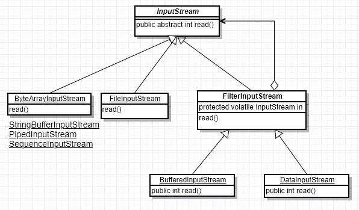

# 装饰器模式

> - 什么是装饰器模式
> - 具体如何实现
> - 应用场景都有哪些
> - 优点与缺点

## 为什么需要装饰器模式

当一个类已经存在，并且可以对外提供核心功能。但是，某个时刻，希望对这个类进行功能增强。通常情况，我们可以修改原来的类，并增加对应的增强功能即可；
但是，这种方式违背了“开-闭”原则，需要修改原来的代码；而且不够灵活，如果有某个时刻又不想使用增强的功能，又需要修改回原来的代码，显然修改原来的类，不是一个很好的解决方案。

## 什么是装饰器模式

> 装饰器模式允许向一个现有的对象添加新的功能，同时又不改变其结构。它是作为现有的类的一个包装。这种模式创建了一个装饰类，用来包装原有的类，并在保持类方法签名完整性的前提下，提供了额外的功能。

## 具体如何实现

 -- 主要角色 --

抽象类：定义一个抽象接口，用以规定这个被装饰者都有哪些功能。

被装饰者类：定义一个具体的对象，具体实现功能。

装饰抽象类：实现了抽象接口,并把抽象类对象作为它的实例变量，从外类来扩展抽象类的功能。

装饰者类：负责具体给原型类增加功能。

## 应用场景都有哪些

如图所示InputStream的类结构图，InputStream类是以抽象组件存在的，而FileInputStream是具体组件，它实现了抽象组件的所有接口.FilterInputStream是装饰角色，它实现了InputStream类的所有接口，并持有InputStream的对象的实例引用；BufferedInputStream是具体的装饰器实现者，它给InputStream附加了功能，这个装饰器类的作用使得InputStream读取的数据保存在内存中，从而提高读取的性能。与这个装饰器类类似的功能还有LineNumberInputStream类，它的作用是提高按行读取数据的功能，它们都让InputStream增强了功能或提升了性能。

## 优点与缺点

优点： 

1、松耦合： 
在不修改原来代码的情况下，动态的为原类增加新功能

2、扩展性高： 
只需要增加新的装饰类，就可以对原类不断增加新功能

3、灵活： 
不需要通过继承来扩展，而且可以动态增加或去除新装饰类，从而随意对原对象增加或减少某些功能

缺点：

多层装饰会提高复杂度。

## 适配器模式与装饰器模式的区别

装饰器与适配器模式都有一个别名叫包装模式，它们的作用看似都是起到包装一个类或对象的作用，但是使用它们的目的不一样。适配器模式的意义是将一个接口转变成另一个接口，通过改变接口达到重复使用的目的；而装饰器模式不是要改变被装饰对象的接口，而恰恰要保持原有的接口，但增强原有对象的功能。所有这两个模式的设计目的是不同的。
