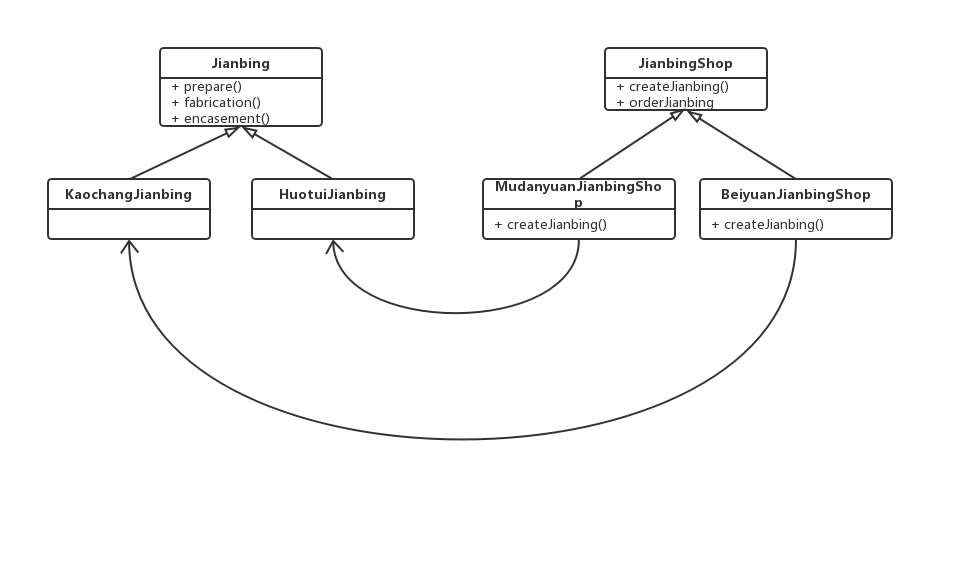
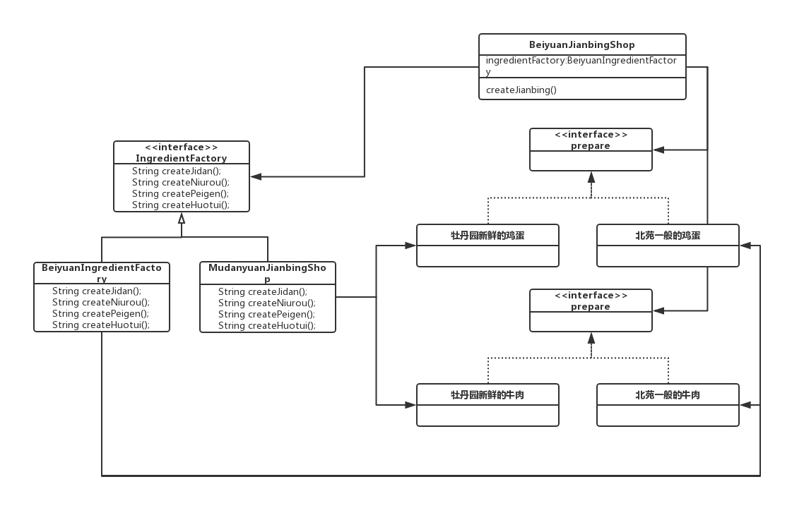

# 工厂模式

## 简单工厂

相信大家都写过类似的代码
```java
    Duck duck;
    if(picnic){
        duck = new MallardDuck();
    }else if(hunting){
        duck = new DecoyDuck();
    }else if(){
        duck = new RubberDuck();
    }
```
这里有一些要实例化的具体类，究竟实例化哪个类，要在运行时由一些条件来决定，一旦判断条件有变化，必须打开这块代码进行检查和修改。通常这样修改过的代码将造成部分系统更难维护和更新，也更容易出错。

所以，遇到这样的问题时，该怎么办呢？我们应该"找出会变化的方面，把它们从不变的部分分离出来"。

下面我们来看下这段代码。
```java
public class JianbingShop {

    String jianbingName ;

    JianbingShop(String jianbingName){
        this.jianbingName = jianbingName;
    }

    public void orderJianbing(){
        Jianbing jianbing = null;
        if(jianbingName.equals("鸡蛋")){
            jianbing = new JidanJianbing();
        }else if(jianbingName.equals("牛肉")){
            jianbing = new NiurouJianbing();
        }else if(jianbingName.equals("培根")){
            jianbing = new PeigenJianbing();
        }else{
            System.out.println("老铁，做不了啊");
        }
        System.out.println("老姜点了个"+jianbing.toString());
        //准备材料
        jianbing.prepare();
        //做煎饼
        jianbing.fabrication();
        //打包
        jianbing.encasement();
    }
}
```
某一天，我们开了一个煎饼果子店，需要根据不同的客户的口味来做不同的煎饼，以前我们只会做鸡蛋、牛肉和培根口味的，突然有一天有个客户说他想吃加烤肠的，并且培根太贵不赚钱，不打算做了，这个时候，大家应该知道哪块是会变的，哪块是不会变的。

那么现在我们应该怎么做呢？

首先，我们应该把创建对象的代码从orderJianbing()方法中抽离。

然后把这部分代码搬到另一个对象中，我们暂且叫它SimpleJianbingFactory，这个新对象只管如何创建煎饼。如果任何对象想要创建煎饼，找它就对了。

```java
public class SimpleJianbingFactory {
    public Jianbing createJianbing(String jianbingName){
        if(jianbingName.equals("鸡蛋")){
            return new JidanJianbing();
        }else if(jianbingName.equals("牛肉")){
            return new NiurouJianbing();
        }else if(jianbingName.equals("培根")){
            return new PeigenJianbing();
        }else{
            System.out.println("老铁，" + jianbingName + "煎饼做不了啊");
            return null;
        }
    }
}
```
问：这么做有什么好处呢？只不过把问题从一个对象搬到了另一个对象罢了，问题依然存在。
答：别忘了，SimpleJianbingFactory可能有很多地方在调用，而不止一个地方在调，当需要改变实现时，只需要改正和一个类即可。同时，我们也把具体实例化的过程从客户代码中删除！

那么客户代码修改成什么样了呢？

```java
public class JianbingShop {
    
    SimpleJianbingFactory simpleJianbingFactory;
    
    public JianbingShop(SimpleJianbingFactory simpleJianbingFactory){
        this.simpleJianbingFactory = simpleJianbingFactory;
    }

    public void orderJianbing(String jianbingName){
        Jianbing jianbing = simpleJianbingFactory.createJianbing(jianbingName);
        System.out.println("老姜点了个"+jianbing.toString());
        jianbing.prepare();
        jianbing.fabrication();
        jianbing.encasement();
    }

}
```

这就是一个"简单工厂"的实现。简单工厂其实并不是一个设计模式，反而更像是一种编码习惯。但是不要因为简单工厂不是一个"真正的"模式，就忽略了它的用法。

## 工厂方法模式

哎，我们的煎饼果子摊开的还不错，突然有一天，老姜说，我也要加盟，桓齐你在牡丹园开，我在北苑也开一家。既然是加盟，做法肯定还是用你之前的做法，只是我不卖火腿的煎饼，我要卖烤肠的。

那么老姜说的做法不变是哪块不变呢？制作煎饼的流程不变，只是加的东西不一样了。

```java
    jianbing.prepare();
    jianbing.fabrication();
    jianbing.encasement();
```

我们前面用简单工厂实现了根据需要创建不同的煎饼，但是现在跟之前不一样了，老姜非得做烤肠的，我还不想做，那怎么办呢。分家！

我们先来修改一下原来的店：

```java
public abstract class JianbingShop {

    public abstract Jianbing createJianbing(String jianbingName);

    public void orderJianbing(String jianbingName){
        Jianbing jianbing = createJianbing(jianbingName);

        if(jianbing == null){
            return;
        }
        System.out.println("老姜点了个"+jianbing.toString());
        jianbing.prepare();
        jianbing.fabrication();
        jianbing.encasement();
    }
}
```

大家注意到，我们把类修改为抽象类了，为什么这样改后面再说。制作煎饼的流程不变，只是获取煎饼类型的地方用一个抽象方法替代。

既然要分，就分的彻底一点，我们把店分成了牡丹园店和北苑店。

```java
class MudanyuanJianbingShop extends JianbingShop{

    @Override
    public Jianbing createJianbing(String jianbingName) {
        if(jianbingName.equals("鸡蛋")){
            return new JidanJianbing();
        }else if(jianbingName.equals("牛肉")){
            return new NiurouJianbing();
        }else if(jianbingName.equals("培根")){
            return new PeigenJianbing();
        }else if(jianbingName.equals("火腿")){//火腿多好吃
            return new HuotuiJianbing();
        }else{
            System.out.println("老铁，" + jianbingName + "煎饼做不了啊");
            return null;
        }
    }
}

class BeiyuanJianbingShop extends JianbingShop{

    @Override
    public  Jianbing createJianbing(String jianbingName){
        if(jianbingName.equals("鸡蛋")){
            return new JidanJianbing();
        }else if(jianbingName.equals("牛肉")){
            return new NiurouJianbing();
        }else if(jianbingName.equals("培根")){
            return new PeigenJianbing();
        }else if(jianbingName.equals("烤肠")){//老姜非得作
            return new KaochangJianbing();
        }else{
            System.out.println("老铁，" + jianbingName + "煎饼做不了啊");
            return null;
        }
    }
}

```
原本由一个对象负责所有对象的实例化，现在通过JianbingShop的一些转变，变成了一群子类来负责实例化。我们能够看出**工厂方法模式**咏来处理对象的创建，并将这样的行为封装在子类中。这样程序中关于父类的代码就和子类对象创建代码解耦了。

我们就用煎饼店来看下工厂模式的类图



**工厂方法模式**（Factory Method Pattern）的定义：在基类中定义创建对象的一个接口，让子类决定实例化哪个类。工厂方法让一个类的实例化延迟到子类中进行。

从类图中我们可以看到，抽象的工厂类提供了一个创建对象的方法的接口，也成为"工厂方法"。

现在，杰明看老姜干的风风火火，想在西直门也开一家店，应该怎么做？

## 抽象工厂模式

有一天，老姜打电话给我说："桓齐，你给我店里送的原料太贵了啊，我不从你这进了，我都少挣好几十万了。"我说："那你随便喽。"然后老姜就开始找原材料供应商。我们首先得知道我们每天都需要买啥是吧。

```java
public interface IngredientFactory {
    String createJidan();
    String createNiurou();
    String createPeigen();
    String createHuotui();
}
```
我们看到了，我开店必须的得买鸡蛋、牛肉、培根、火腿等材料，那起码这个供应商要具备这些能力才行。

牡丹园店和北苑店都去哪进呢？

```java
class MudanyuanIngredientFactory implements IngredientFactory{

    @Override
    public String createJidan() {
        System.out.println("从牡丹园菜市场进的新鲜鸡蛋");
        return "牡丹园鸡蛋";
    }

    @Override
    public String createNiurou() {
        System.out.println("从牡丹园菜市场进的新鲜牛肉");
        return "牡丹园牛肉";
    }

    @Override
    public String createPeigen() {
        System.out.println("从牡丹园菜市场进的新鲜培根");
        return "牡丹园培根";
    }

    @Override
    public String createHuotui() {
        System.out.println("从牡丹园菜市场进的新鲜火腿");
        return "牡丹园火腿";
    }
}

class BeiyuanIngredientFactory implements IngredientFactory{
    @Override
    public String createJidan() {
        System.out.println("从北苑菜市场进的一般鸡蛋");
        return "北苑鸡蛋";
    }

    @Override
    public String createNiurou() {
        System.out.println("从北苑菜市场进的一般牛肉");
        return "北苑牛肉";
    }

    @Override
    public String createPeigen() {
        System.out.println("从北苑菜市场进的一般培根");
        return "北苑培根";
    }

    @Override
    public String createHuotui() {
        System.out.println("从北苑菜市场进的一般火腿");
        return "北苑火腿";
    }
}
```

现在由于原材料变了，我们不得不重新开始做煎饼果子了。

```java
public class NewJidanJianbing extends Jianbing {
    private IngredientFactory ingredientFactory;

    public NewJidanJianbing(IngredientFactory ingredientFactory){
        this.ingredientFactory = ingredientFactory;
    }

    @Override
    public void prepare(){
        System.out.println("准备"+ingredientFactory.createJidan());
    }

    @Override
    public String toString() {
        return "从不同原料工厂进材料做的鸡蛋煎饼";
    }
}
```

新的煎饼果子可以根据不同原料工厂提供的原料来制作了。

最后，我们来看看老姜到底怎么把这个煎饼果子做出来：

```java
public class BeiyuanJianbingShop extends JianbingShop{

    private IngredientFactory ingredientFactory;

    BeiyuanJianbingShop(){
        ingredientFactory = new BeiyuanIngredientFactory();
    }

    @Override
    public  Jianbing createJianbing(String jianbingName){
        if(jianbingName.equals("鸡蛋")){
            return new NewJidanJianbing(ingredientFactory);
        }else if(jianbingName.equals("牛肉")){
            return new NewNiurouJianbing(ingredientFactory);
        }else{
            System.out.println("老铁，" + jianbingName + "煎饼做不了啊");
            return null;
        }
    }

    public static void main(String[] args) {
        String jianbing = "鸡蛋";
        BeiyuanJianbingShop jianbingShop = new BeiyuanJianbingShop();
        jianbingShop.orderJianbing(jianbing);
    }
}
```

这一连串的代码改变，我们到底做了些什么？

我们引入了新类型的工厂，也就是所谓的**抽象工厂**，来创建煎饼果子原料。通过抽象工厂所提供的接口，我们的代码从实际工厂解耦，以便在不同上下文中实现各式各样的工厂，制作出不同的产品。

因为代码从实际的产品中解耦了，所以我们可以替换不同的工厂来取得不同的行为。



**抽象工厂模式**（Abstract Factory Pattern）的定义：提供一个接口，用于创建相关或依赖对象的家族，而不需要明确指定具体类。

抽象工厂的方法经常以工厂方法的方式实现，抽象工厂的任务是定义一个负责创建一组产品的接口。这个接口内的每个方法都负责创建一个具体产品。


## 总结

工厂方法模式与抽象工厂模式，虽然名称中都有工厂，但并不表示两者应该放到一起来访问。但他们两个有一些共同点：把程序从特定实现中解耦。

但是两者也有区别，虽然两者都是负责创建对象，但是工厂方法模式使用的是**继承**，而抽象工厂模式使用的是**组合**。

既然抽象工厂使用的是组合，不知道大家有没有发现一个问题，当我们使用抽象工厂时，一旦需要扩展这组产品（比如新增一个新的产品），必须改变接口。

要点：

> - 所有的工厂都是用来封装对象的创构建。
> - 简单工厂，虽然不是真正的设计模式，但扔不失为一个简单的方法，可以将具体客户程序从具体类解耦。
> - 工厂方法使用继承，把对象的创建委托给子类，子类实现工厂方法来创建对象。
> - 抽象工厂使用对象组合，对象的创建被实现在工厂接口所暴露出来的方法中。
> - 所有工厂模式都通过减少应用程序和具体类之间的依赖促进松耦合。
> - 工厂方法允许类将实例化延迟到子类进行。
> - 抽象工厂创建相关的对象家族，而不需要依赖他们的具体类。
> - 依赖导致原则，指导我们避免依赖具体类型，而要尽量依赖抽象。
> - 工厂是很有威力的技巧，帮助我们针对抽象编程，而不是针对具体的类编程。

用通俗的话总结一下就是：

工厂方法模式：我可以把你的客户代码从需要实例化的具体类中解耦，或者你目前还不知道将来需要实例化哪些具体类时，也可以用我。

抽象工厂模式：当你需要创建产品家族或想让制造的相关产品集合起来时，你可以使用我。
