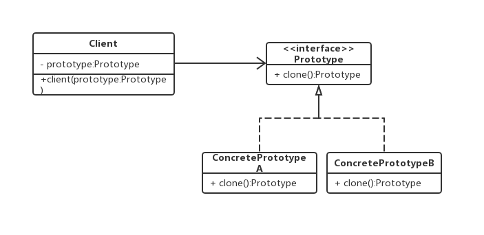

# 原型模式

当我们要学习原型模式或者其他的设计模式时，通常需要问几个问题
> - 什么是原型模式
> - 什么时候可以派上用场
> - 具体如何实现
> - 都有优缺点

## 什么是原型模式

**原型模式（Prototype Pattern）**的定义：用原型实例指定创建对象的种类，并且通过拷贝原型实例来创建新的对象。（Specify the kind of objects to create using a prototypical instance, and create new objects by copying this prototype. ）

这里面有几个关键词，**用原型实例**说明原型模式有一个前提，就是我得先有一个实例，**拷贝**说明是复制，而不是创建，**拷贝**这个词用Java翻译，就是clone，我们后面再说。

原型模式从某种意义上说，就像是new操作，在前面的例子实现中，克隆方法就是使用new来实现的，但请注意，只是“类似于new”而不是“就是new”。

克隆方法和new操作最明显的不同就在于：

> new一个对象实例，一般属性是没有值的，或者是只有默认值；如果是克隆得到的一个实例，通常属性是有值的，属性的值就是原型对象实例在克隆的时候，原型对象实例的属性的值。


## 原型模式怎样来实现

我们带着第二个问题，先来看第三个问题。

在讨论具体事前之前，我们先来看两个概念：**浅复制**和**深复制**

浅复制（浅克隆） ：只负责克隆按值传递的数据（比如：基本数据类型、String类型）。

深复制（深克隆） ：除了浅度克隆要克隆的值外，还负责克隆引用类型的数据，基本上就是被克隆实例所有的属性的数据都会被克隆出来。

我们先来看看**浅复制**。

```
public class ShallowStudent implements Cloneable{
    private String name;
    private int age;
    Professor p;

    ShallowStudent(String name, int age, Professor p) {
        this.name = name;
        this.age = age;
        this.p = p;
    }

    @Override
    public Object clone() {
        ShallowStudent o = null;
        try {
            // Object中的clone()识别出你要复制的是哪一个对象。
            o = (ShallowStudent) super.clone();
        } catch (CloneNotSupportedException e) {
            System.out.println(e.toString());
        }
        return o;
    }

    public static void main(String[] args) {
        Professor p = new Professor("jiangtao",35);
        ShallowStudent s1 = new ShallowStudent("weijieming", 18,p);
        System.out.println("复制前，原对象基本属性："+"name=" + s1.name + "," + "age=" + s1.age);
        System.out.println("复制前，原对象引用属性："+"name=" + s1.p.name + "," + "age=" + s1.p.age);
        ShallowStudent s2 = (ShallowStudent) s1.clone();
        s2.name = "like";
        s2.age = 20;
        //修改学生2后，不影响学生1的值。
        System.out.println("==========================================================");
        System.out.println("复制后，原对象基本属性："+"name=" + s1.name + "," + "age=" + s1.age);
        System.out.println("复制后，复制对象基本属性："+"name=" + s2.name + "," + "age=" + s2.age);

        s2.p.name = "zhanghuanqi";
        s2.p.age = 18;
        //修改学生2引用对象后，影响学生1的值。
        System.out.println("==========================================================");
        System.out.println("复制后，原对象引用属性："+"name=" + s1.p.name + "," + "age=" + s1.p.age);
        System.out.println("复制后，复制对象引用属性："+"name=" + s2.p.name + "," + "age=" + s2.p.age);
    }
}

class Professor {
    String name;
    int age;

    Professor(String name, int age) {
        this.name = name;
        this.age = age;
    }
}

```
这段代码的输出如下：
```
复制前，原对象基本属性：name=weijieming,age=18
复制前，原对象引用属性：name=jiangtao,age=35
==========================================================
复制后，原对象基本属性：name=weijieming,age=18
复制后，复制对象基本属性：name=like,age=20
==========================================================
复制后，原对象引用属性：name=zhanghuanqi,age=18
复制后，复制对象引用属性：name=zhanghuanqi,age=18

```

从这段代码可以看出，基本数据类型的变量都会重新创建，而引用类型，指向的还是原对象所指向的对象。

我们再来看下**深复制**。
```
public class DeepStudent implements Cloneable , Serializable {
    DeepProfessor p;

    DeepStudent(DeepProfessor p) {
        this.p = p;
    }

    @Override
    public Object clone() {
        DeepStudent o = null;
        try {
            o = (DeepStudent) super.clone();
            //对引用的对象也进行复制
            o.p = (DeepProfessor) p.clone();
        } catch (CloneNotSupportedException e) {
            System.out.println(e.toString());
        }
        return o;
    }

    public Object deepClone(Object o) {
        try{
            //将对象写到流里
            ByteArrayOutputStream bo=new ByteArrayOutputStream();
            ObjectOutputStream oo=new ObjectOutputStream(bo);
            oo.writeObject(o);
            //从流里读出来
            ByteArrayInputStream bi=new ByteArrayInputStream(bo.toByteArray());
            ObjectInputStream oi=new ObjectInputStream(bi);
            return(oi.readObject());
        }catch (Exception e){
            e.printStackTrace();
            return null;
        }
    }

    public static void main(String[] args) {
        DeepProfessor p = new DeepProfessor("jiangtao", 50);
        DeepStudent s1 = new DeepStudent(p);
        System.out.println("复制前，原对象引用属性："+"name=" + s1.p.name + "," + "age=" + s1.p.age);
        DeepStudent s2 = (DeepStudent) s1.clone();
        s2.p.name = "zhanghuanqi";
        s2.p.age = 18;
        DeepStudent s3 = (DeepStudent) s1.deepClone(s1);
        s3.p.name = "like";
        s3.p.age = 18;
        System.out.println("==========================================================");
        System.out.println("复制后，原对象基本属性："+"name=" + s1.p.name + "," + "age=" + s1.p.age);
        System.out.println("复制后，s2引用属性："+"name=" + s2.p.name + "," + "age=" + s2.p.age);
        System.out.println("复制后，s3引用属性："+"name=" + s3.p.name + "," + "age=" + s3.p.age);
    }
}

class DeepProfessor implements Cloneable,Serializable {
    String name;
    int age;

    DeepProfessor(String name, int age) {
        this.name = name;
        this.age = age;
    }

    @Override
    public Object clone() {
        DeepProfessor o = null;
        try {
            o = (DeepProfessor)super.clone();
        } catch(CloneNotSupportedException e) {
            System.out.println(e.toString());
        }
        return o;
    }
}
```
输出如下：
```
复制前，原对象引用属性：name=jiangtao,age=50
==========================================================
复制后，原对象基本属性：name=jiangtao,age=50
复制后，s2引用属性：name=zhanghuanqi,age=18
复制后，s3引用属性：name=like,age=18
```
与浅复制相比，DeepProfessor对象实现了Cloneable接口，所以DeepStudent对象在克隆时，进行了深复制。深复制后，在内存中重新创建了一个新的DeepProfessor对象。

同时，还有另外一种方式实现深复制，用IO读写的方式，直接在内存中分配了一块新的内存，将原对象在新的空间创建。

理解了浅复制和深复制，那么我们开始看一下原型模式的实现



原型模式中共有三个角色：

**Prototype（抽象原型类）**：它是声明克隆方法的接口，是所有具体原型类的公共父类，可以是抽象类也可以是接口，甚至还可以是具体实现类。

**ConcretePrototype（具体原型类）**：它实现在抽象原型类中声明的克隆方法，在克隆方法中返回自己的一个克隆对象。

**Client（客户类）**：让一个原型对象克隆自身从而创建一个新的对象，在客户类中只需要直接实例化或通过工厂方法等方式创建一个原型对象，再通过调用该对象的克隆方法即可得到多个相同的对象。由于客户类针对抽象原型类Prototype编程，因此用户可以根据需要选择具体原型类，系统具有较好的可扩展性，增加或更换具体原型类都很方便。

1. 先来看看原型接口的定义，示例代码如下：

```java
public interface Prototype {
    /**
     * 克隆自身的方法
     * @return 一个从自身克隆出来的对象
     */
    Prototype clone();
}
```

2. 接下来看看具体的原型实现对象，示例代码如下：

```java
class ConcretePrototypeA implements Prototype{
    private String name = null;
    private int age = 0;

    public String getName() {
        return name;
    }

    public void setName(String name) {
        this.name = name;
    }

    public int getAge() {
        return age;
    }

    public void setAge(int age) {
        this.age = age;
    }

    @Override
    public Prototype clone() {
        ConcretePrototypeA prototype = new ConcretePrototypeA();
        prototype.setAge(this.age);
        prototype.setName(this.name);
        return prototype;
    }

    @Override
    public String toString() {
        return "ConcretePrototypeA{" +
                "name='" + name + '\'' +
                ", age=" + age +
                '}';
    }
}


class ConcretePrototypeB implements Prototype{

    private String name;

    private int age;

    public String getName() {
        return name;
    }

    public void setName(String name) {
        this.name = name;
    }

    public int getAge() {
        return age;
    }

    public void setAge(int age) {
        this.age = age;
    }

    @Override
    public Prototype clone() {
        ConcretePrototypeB prototype = new ConcretePrototypeB();
        prototype.setAge(this.age);
        prototype.setName(this.name);
        return prototype;
    }

    @Override
    public String toString() {
        return "ConcretePrototypeB{" +
                "name='" + name + '\'' +
                ", age=" + age +
                '}';
    }
}

```
为了跟上面原型模式的结构示意图保持一致，因此这两个具体的原型实现对象

3. 再看看使用原型的客户端，示例代码如下：

```java
public class Client {
    public void client(Prototype prototype){
        System.out.println("原对象：" + prototype + " hashcode：" + System.identityHashCode(prototype));
        Prototype copyPrototype = prototype.clone();
        System.out.println("克隆对象：" + copyPrototype+ " hashcode：" + System.identityHashCode(copyPrototype));
    }

    public static void main(String[] args) {
        Client prototypeClient = new Client();
        ConcretePrototypeA concretePrototypeA = new ConcretePrototypeA();
        concretePrototypeA.setName("jiangtao");
        concretePrototypeA.setAge(50);
        prototypeClient.client(concretePrototypeA);

        ConcretePrototypeB concretePrototypeB = new ConcretePrototypeB();
        concretePrototypeB.setName("zhanghuanqi");
        concretePrototypeB.setAge(18);
        prototypeClient.client(concretePrototypeB);
    }
}
```

## 有何优缺点

主要优点如下：
> - 当创建新的对象实例较为复杂时，使用原型模式可以简化对象的创建过程，通过复制一个已有实例可以提高新实例的创建效率。
> - 扩展性较好，由于在原型模式中提供了抽象原型类，在客户端可以针对抽象原型类进行编程，而将具体原型类写在配置文件中，增加或减少产品类对原有系统都没有任何影响。
> - 原型模式提供了简化的创建结构，工厂方法模式常常需要有一个与产品类等级结构相同的工厂等级结构，而原型模式就不需要这样，原型模式中产品的复制是通过封装在原型类中的克隆方法实现的，无须专门的工厂类来创建产品。

主要缺点如下：
> - 需要为每一个类配备一个克隆方法，而且该克隆方法位于一个类的内部，当对已有的类进行改造时，需要修改源代码，违背了“开闭原则”。
> - 在实现深克隆时需要编写较为复杂的代码，而且当对象之间存在多重的嵌套引用时，为了实现深克隆，每一层对象对应的类都必须支持深克隆，实现起来可能会比较麻烦。


## 什么时候可以派上用场
> - 创建新对象成本较大（如初始化需要占用较长的时间，占用太多的CPU资源或网络资源），新的对象可以通过原型模式对已有对象进行复制来获得，如果是相似对象，则可以对其成员变量稍作修改。
> - 可以使用深克隆的方式保存对象的状态，使用原型模式将对象复制一份并将其状态保存起来，以便在需要的时候使用（如恢复到某一历史状态），可辅助实现撤销操作
> - 需要避免使用分层次的工厂类来创建分层次的对象，并且类的实例对象只有一个或很少的几个组合状态，通过复制原型对象得到新实例可能比使用构造函数创建一个新实例更加方便。


