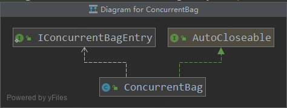

# 【HikariCP源码阅读】ConcurrentBag学习
###### 详细源码分析见： https://github.com/khakili/HikariCP/blob/dev/src/main/java/com/zaxxer/hikari/util/ConcurrentBag.java

## ConcurrentBag
   
    ConcurrentBag是HikariCP的核心工具类，它主要用来维护PoolEntry，ConcurrentBag提供了LinkedBlockingQueue和LinkedTransferQueue
    的功能，它使用本地变量来减少并发访问加锁。如果本地线程中没有可以使用的PoolEntry，则在共享集合中获取。

## ConcurrentBag 获取PoolEntry
> borrow方法并不会删除元素
```java
    /**
    * 获取entry，可以指定超时时间
    */
   public T borrow(long timeout, final TimeUnit timeUnit) throws InterruptedException {
      // Try the thread-local list first
      //先尝试从ThreadLocal中取，避免竞争
      final List<Object> list = threadList.get();
      for (int i = list.size() - 1; i >= 0; i--) {
         final Object entry = list.remove(i);
         @SuppressWarnings("unchecked") final T bagEntry = weakThreadLocals ? ((WeakReference<T>) entry).get() : (T) entry;
         //判断entry是否在使用中
         if (bagEntry != null && bagEntry.compareAndSet(STATE_NOT_IN_USE, STATE_IN_USE)) {
            return bagEntry;
         }
      }
      //ThreadLocal中没有取到entry，则去共享队列中拿
      // Otherwise, scan the shared list ... then poll the handoff queue
      //计数器+1
      final int waiting = waiters.incrementAndGet();
      try {
         for (T bagEntry : sharedList) {
            //判断entry是否在使用中
            if (bagEntry.compareAndSet(STATE_NOT_IN_USE, STATE_IN_USE)) {
               // If we may have stolen another waiter's connection, request another bag add.
               //如果有两个以上的线程在竞争获取entry,则触发监听器，创建entry
               if (waiting > 1) {
                  listener.addBagItem(waiting - 1);
               }
               return bagEntry;
            }
         }
         //没有从集合中获取entry，则触发监听器，创建entry
         listener.addBagItem(waiting);

         timeout = timeUnit.toNanos(timeout);
         do {
            final long start = currentTime();
            //尝试从队列中获取entry
            final T bagEntry = handoffQueue.poll(timeout, NANOSECONDS);
            //如果获取到了，将entry设置为使用中，并返回
            if (bagEntry == null || bagEntry.compareAndSet(STATE_NOT_IN_USE, STATE_IN_USE)) {
               return bagEntry;
            }
            timeout -= elapsedNanos(start);
            //循环，直到超时，返回null
         } while (timeout > 10_000);

         return null;
      } finally {
         //释放计数器（-1）
         waiters.decrementAndGet();
      }
   }

```