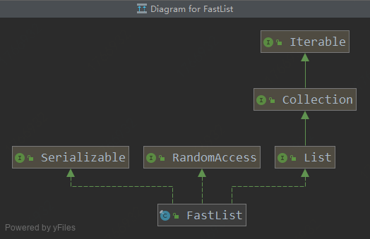
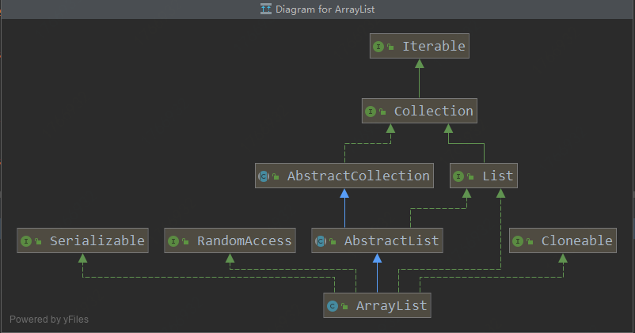

# 【HikariCP源码分析】FastList介绍
###### FastList与ArrayList对比，具体源码分析请看： https://github.com/khakili/HikariCP/blob/dev/src/main/java/com/zaxxer/hikari/util/FastList.java
## FastList类图



## FastList与ArrayList的异同

###相同点：
   - 全部都实现了List<T>, RandomAccess, Serializable接口
   - 都是非线程安全的类
   - 都是以数组存储元素
### 不同点：
   - FastList不支持Clone
   - FastList默认构造函数初始化了一个长度为32的数组，而ArrayList默认创建了一个空数组
   - FastList有很多方法都没有实现，如集合的交并补
   - FastList存储的Item是泛型实际类型的数组，而ArrayList存储的是Object数组
   - FastList扩容2倍，ArrayList扩容1.5倍
### FastList快在哪里？
    FastList是根据HikariCP的需求定制开发的一个数据结构（精简版的ArrayList），
    他主要是在get方法 和 remove方法做了一些优化。
    
```java
//FastList的get方法，不会像ArrayList，每次获取元素都去检查index是否越界
public T get(int index)
   {
      return elementData[index];
   }
//FastList的remove方法，与ArrayList不同的是，它是采取倒序循环的方式去找要删除的元素，
// 至于为什么要倒序循环，在后面的源码分析会有所解释
public boolean remove(Object element)
   {
      for (int index = size - 1; index >= 0; index--) {
         if (element == elementData[index]) {
            final int numMoved = size - index - 1;
            if (numMoved > 0) {
               System.arraycopy(elementData, index + 1, elementData, index, numMoved);
            }
            elementData[--size] = null;
            return true;
         }
      }
      return false;
   }
```
