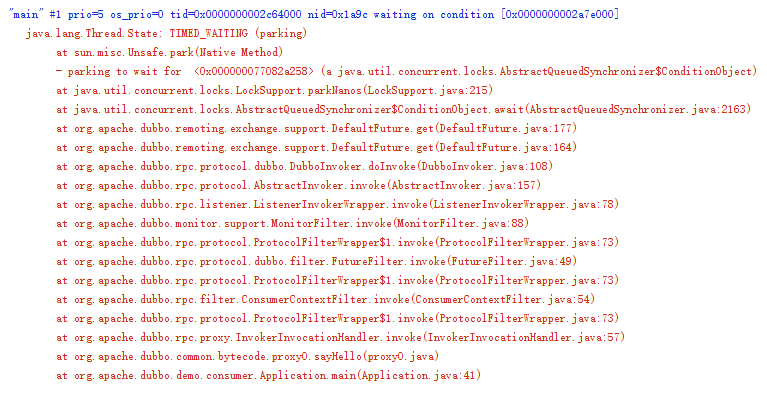

# Lock&Condition（下）:如何异步转同步

Java语言内置的管程里只有一个条件变量，而Lock&Condition实现的管程是支持多个条件变量的，这是二者的一个重要区别，**Condition实现了管程模型里面的条件变量**。

在很多并发场景下，支持多个条件变量能够让我们的并发程序可读性更好，实现起来也更容易。

## 如何利用两个条件变量快速实现阻塞队列？


## 同步与异步

同步和异步的区别到底是什么呢？**通俗点来讲就是调用方是否需要等待结果，如果需要等待结果，就是同步；如果不需要等待结果，就是异步。**

同步是Java代码默认的处理方式。如果你想让你的程序支持异步，可以通过下面的方式来实现：

> 1. 调用方法创建一个子线程，在子线程中执行方法调用，这种调用我们称为异步调用；
> 2. 方法实现的时候，创建一个新的线程执行主要逻辑，主线程直接return，这种方法我们一般称为异步方法。

## Dubbo 源码分析

TCP协议本身就是异步的，我们工作中常用到的RPC调用，**在TCP协议层面，发送完RPC请求后，线程是不会等待RPC的响应结果的**。但是我们平时工作中的RPC的调用大多数都是同步的啊？怎么回事儿呢？

很简单，有人帮我们做了异步转同步的事情。我们来分析下Dubbo是怎么做的。

对于一个简单的RPC调用，默认情况下sayHello()方法，是个同步方法，也就是说，执行service.sayHello("dubbo")的时候，线程会停下来等结果。

```java

DemoService service = 初始化部分省略
String message = service.sayHello("dubbo");
System.out.println(message);

```

我们把调用线程dump出来的话，会是下图的这个样子，你会发现调用线程阻塞了，线程状态是TIMED_WAITING。本来发送请求是异步的，但是调用线程却阻塞了，说明Dubbo帮我们做了异步转同步的事情。通过调用栈，你能看到线程是阻塞在DefaultFuture.get()方法上，所以可以推断：Dubbo异步转同步的功能应该是通过DefaultFuture这个类实现的。



不过为了理清前后关系，我们有必要分析下调用DefaultFuture.get()之前发生了什么。DubboInvoker的108行调用了DefaultFuture.get()，这一行很关键，我们稍微修改一下列在下面。这一行先调用了request(inv,timeout)方法，这个方法其实就是发送RPC请求，之后通过调用get()方法等待RPC返回结果。

```java

public class DubboInvoker{
  Result doInvoke(Invocation inv){
    // 下面这行就是源码中 108 行
    // 为了便于展示，做了修改
    return currentClient 
      .request(inv, timeout)
      .get();
  }
}

```

DefaultFuture这个类很关键，我们把相关代码精简之后，列到下面。不过我们在看代码之前，有必要重复下我们的需求：当RPC返回结果之前，阻塞调用线程，让调用线程等待；当RPC返回结果后，唤醒调用线程，让调用线程重新执行。这不就是经典的等待-通知机制吗？

```java
// 创建锁与条件变量
private final Lock lock = new ReentrantLock();
private final Condition done = lock.newCondition();

// 调用方通过该方法等待结果
Object get(int timeout){
  long start = System.nanoTime();
  lock.lock();
  try {
	while (!isDone()) {
	  done.await(timeout);
      long cur=System.nanoTime();
	  if (isDone() || 
          cur-start > timeout){
	    break;
	  }
	}
  } finally {
	lock.unlock();
  }
  if (!isDone()) {
	throw new TimeoutException();
  }
  return returnFromResponse();
}
// RPC 结果是否已经返回
boolean isDone() {
  return response != null;
}
// RPC 结果返回时调用该方法   
private void doReceived(Response res) {
  lock.lock();
  try {
    response = res;
    if (done != null) {
      done.signal();
    }
  } finally {
    lock.unlock();
  }
}

```

调用线程通过调用get()方法等待RPC返回结果，这个方法里面，我们看到的都是熟悉的"面孔"：调用lock()获取锁，在finally里面调用unlock()释放锁；获取锁后，通过经典的在循环中调用 await() 方法来实现等待。

当RPC结果返回时，会调用doReceived()方法，这个方法里面，调用lock()获取锁，在finally里面调用unlock()释放锁，获取锁后通过调用signal()来通知调用线程，结果已经返回，不用继续等待了。

## 总结

Lock&Condition是管程的一种实现，所以能否用好Lock和Condition要看你对管程模型理解的怎么样。

Lock&Condition实现的管程相对于synchronized实现的管程来说更加灵活、功能也更丰富。


