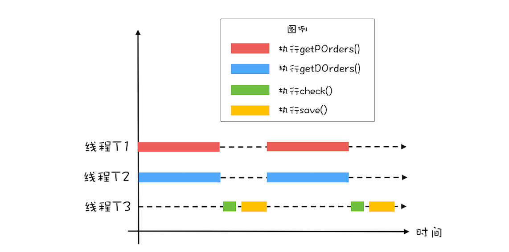

# CountDownLatch和CyclicBarrier：如何让多线程步调一致

前几天老板突然过来说，对账系统最近越来越慢，能不能快速优化一下。对账系统的业务是，用户通过商城下单，保存在订单库，之后物流会生成派送单给用户发货，派送单保存在派送单库。为了防止漏派送或者重复派送，对账系统每天还会检验是否存在异常订单。

对账系统的逻辑很简单，可以参照下面的对账系统流程图。目前对账系统的处理逻辑是首先查询订单，然后查询派送单，之后对比订单和派送单，将差异写入差异库。


对账系统的代码抽象之后，也很简单，核心代码如下，就是在一个单线程里面循环查询订单、派送单，然后执行对账，最后将差异写入差异库。

```java
while(存在未对账订单){
  // 查询未对账订单
  pos = getPOrders();
  // 查询派送单
  dos = getDOrders();
  // 执行对账操作
  diff = check(pos, dos);
  // 差异写入差异库
  save(diff);
} 
```
## 利用并行优化对账系统

我们要优化这段代码，得先找到对账系统的瓶颈所在。

目前的对账系统，由于订单量和派送单量巨大，所以查询未对账订单getPOrder()和查询派送单getDOrder()先对较慢，那有没有办法快速优化一下呢？目前对账系统是单线程执行的，图形化后是下图这个样子。对于串行化的系统，优化性能首先想到的是**能否利用多线程并行处理**。


所以，这里你应该能够看出来这个对账系统里的瓶颈：查询未对账订单getPOrder()和查询派送单getDOrder()是否可以并行处理呢？显然是可以的，因为这两个操作**并没有先后顺序的依赖**。这两个最耗时的操作并行之后，执行过程如下图所示。对比一下单线程的执行示意图，你会发现同等时间里，并行执行的吞吐量近乎单线程的2倍，优化效果还是相对明显的。



思路有了，下面我们再来看看如何用代码实现。在下面的代码中，我们创建了两个线程T1和T2，并行执行查询未对账订单getPOrder()和查询派送单getDOrder()这两个操作。在主线程中执行对账操作check()和差异写入save()两个操作。不过需要注意的是：主线程需要等待线程T1和T2执行完才能执行check()和save()这两个操作，为此我们通过调用T1.join()和T2.join()来实现等待，当T1和T2线程退出时，调用T1.join()和T2.join()的主线程就会从阻塞态被唤醒，从而执行之后的check()和save()。

```java
while(存在未对账订单){
  // 查询未对账订单
  Thread T1 = new Thread(()->{
    pos = getPOrders();
  });
  T1.start();
  // 查询派送单
  Thread T2 = new Thread(()->{
    dos = getDOrders();
  });
  T2.start();
  // 等待 T1、T2 结束
  T1.join();
  T2.join();
  // 执行对账操作
  diff = check(pos, dos);
  // 差异写入差异库
  save(diff);
} 

```
## 用CountDownLatch实现线程等待

经过上面的优化，基本可以收工了，但是美中不足的是，while循环里面每次都会创建新的线程，而创建线程可是个耗时的操作。所以最好是创建出来的线程能够循环利用，估计这时你已经想到线程池了，是的，线程池就能解决这个问题。

我们定义一个线程池，固定大小为2，之后在while里面循环利用。一切看上去都很顺利，但是有个问题好像无解，那就是主线程如何知道getPOrder()和getDOrder()这两个操作什么时候执行完。前面主线程通过调用线程T1和线程T2的join()方法来等待线程T1和T2退出，但是在线程池的方案里，线程根本就不会退出，所以join()方法已经失效了。

```java
// 创建 2 个线程的线程池
Executor executor = 
  Executors.newFixedThreadPool(2);
while(存在未对账订单){
  // 查询未对账订单
  executor.execute(()-> {
    pos = getPOrders();
  });
  // 查询派送单
  executor.execute(()-> {
    dos = getDOrders();
  });
  
  /* ？？如何实现等待？？*/
  
  // 执行对账操作
  diff = check(pos, dos);
  // 差异写入差异库
  save(diff);
}   

```

**CountDownLatch**可以帮我们解决这个问题。在while循环里面，我们首先创建一个CountDownLatch，计数器的初始值等于2，之后在 pos = getPOrder();和 dos = getDOrder();两条语句后面对计数器进行减1操作，这个对计数器减1的操作是通过调用latch.countDown();来实现的。在主线程中，我们通过调用 latch.await()来实现对计数器等于0的等待。

```java
// 创建 2 个线程的线程池
Executor executor = 
  Executors.newFixedThreadPool(2);
while(存在未对账订单){
  // 计数器初始化为 2
  CountDownLatch latch = 
    new CountDownLatch(2);
  // 查询未对账订单
  executor.execute(()-> {
    pos = getPOrders();
    latch.countDown();
  });
  // 查询派送单
  executor.execute(()-> {
    dos = getDOrders();
    latch.countDown();
  });
  
  // 等待两个查询操作结束
  latch.await();
  
  // 执行对账操作
  diff = check(pos, dos);
  // 差异写入差异库
  save(diff);
}

```

