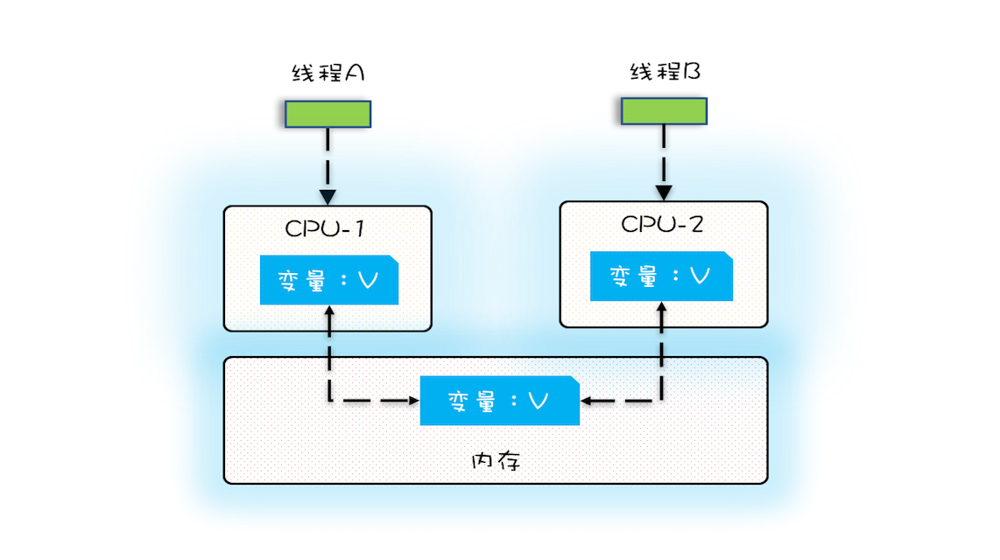

# 万恶之源：可见性、有序性及原子性问题

## 并发程序幕后的故事

在计算机中，CPU、内存、I/O一直都存在速度的差异。程序里大部分语句都需要访问内存，有些还要访问I/O，根据木桶理论，程序整体性能取决于最慢的操作。

为了合理利用CPU的高性能，平衡三者差异，计算机体系机构、操作系统、编译程序都做出了贡献，主要体现为：

> * CUP增加了缓存，以均衡与内存的速度差异
> * 操作系统增加了进程、线程，以分时复用CPU，进而均衡CPU与I/O设备的速度差异；
> * 编译程序优化指令执行次序，使得缓存能够得到更加合理的利用。

并发程序很多诡异问题的根源也在这里。

## 源头之一：缓存导致的可见性问题

在单核时代，所有进程都在一颗CPU上运行，所以CPU缓存与内存的数据一致性就容易解决，因为所有进程都操作一个CPU的缓存，一个进程对缓存的写对另外一个进程来说一定是可见的。

一个进程对共享变量的修改，另外一个进程能立刻看到，我们成为**可见性**。

多核时代，每颗CPU都有自己的缓存，这时CPU缓存与内存的数据一致性就没那么容易解决了。

## 源头之二 线程切换带来的原子性问题

操作系统允许进程执行一小段时间，例如50毫秒，过了50毫秒操作系统会重新选择一个进程来执行（我们成为"任务切换"），这个50毫秒成为"时间片"。

由于I/O太慢，如果一个进程进行一个I/O操作，例如读个文件，这个时候进程可以把自己标记为"休眠状态"并让出CPU的使用权，待文件读取完毕后，操作系统会把这个休眠的进程重新唤醒，唤醒后该进程就有机会重新获取CPU的使用权。

这里的进程等待I/O时之所以会释放CPU使用权，是为了让CPU在这段等待时间里可以做别的事情，这样CPU的使用率就上来了。

任务切换的时机大多数是在时间片结束的时候，我们现在基本都使用高级语言编程，高级语言里一条语句往往需要多条CPU指令完成。
如：
`
    count += 1
`
需要三条CPU指令。

> * 首先，需要将变量count从内存加载到CPU的寄存器；
> * 之后，在寄存器中执行 +1 操作；
> * 最后，将结果写入内存

操作系统做任何切换，可以发生在任何一条**CPU指令**执行完。对于上面的三条指令来说，我们假设count=0，如果线程A在指令1执行完后做线程切换，线程A和线程B按照下图的序列执行，那么我们会发现两个线程都执行了 count+=1 操作，得到的结果不是我们期望的2，而是1。

**我们把一个或者多个操作在CPU执行的过程中不被终端的特性成为原子性**。CPU能保证的原子操作是CPU指令级别的，而不是高级语言的操作符，因此，很多时候我们需要在高级语言层面保证操作的原子性。

## 源头之三：编译优化带来的有序性问题

有序性指的是程序按照代码的先后顺序执行。编译器为了优化性能，有时候会改变程序中语句的先后顺序，例如程序中"a=1;b=2;"编译器优化后可能变成"b=2;a=1;"，有时候编译器及解释器优化可能导致意想不到的BUG。

## 总结

我们要写好并发程序，需要知道并发程序的问题在哪，只要深刻理解可见性、原子性、有序性在并发场景下的原理，很多并发BUG都是可以理解的、可以诊断的。

并发问题的问题之源，可以归纳为：

> * **缓存**导致的可见性问题；
> * **线程切换**带来的原子性问题；
> * **编译优化**带来的有序性问题；

所以我们在采用一项技术的同时，一定要清楚它带来的问题是什么，以及如何规避。

