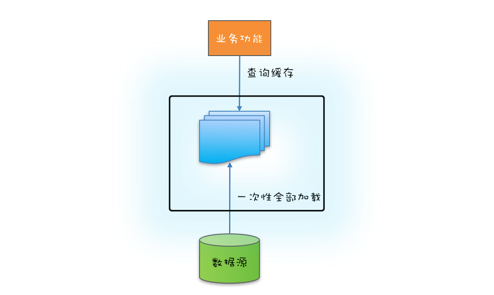

# ReadWriteLock:如何快速实现一个完备的缓存

前面我们介绍了管程和信号量两个同步原语在Java语言中的实现，理论上用这两个同步原语中的任何一个都可以解决所有的并发问题。那Java SDK并发包里为什么还有很多其他的工具类呢？原因很简单：**分场景优化性能，提升易用性**。

今天我们就介绍一种非常普遍的并发场景：读多写少场景。实际工作中，为了优化性能，我们经常会使用缓存，例如缓存元数据、缓存基础数据等，这就是一种典型的读多写少的，元数据和基础数据基本上不会发生变化（写少），但是使用它们的地方却很多（读多）。

针对读多写少这种并发场景，Java SDK并发包提供了读写锁——ReadWriteLock，非常容易使用，并且性能很好。

## 那什么是读写锁呢？

读写锁，并不是Java语言特有的，而是一个广为使用的通用技术，所有的读写锁都遵守以下三条基本原则：

> 1. 允许多个线程同时读共享变量；
> 2. 只允许一个线程写共享变量；
> 3. 如果一个写线程正在执行写操作，此时禁止线程读共享变量。

读写锁与互斥锁的一个重要区别就是**读写锁允许多个线程同时读共享变量**，而互斥锁是不允许的，这是读写锁在读多写少场景下性能优于互斥锁的关键。但**读写锁的写操作是互斥的**，当一个线程在写共享变量的时候，是不允许其他线程执行写操作和读操作的。

## 快速实现一个缓存

我们实践起来，用ReadWriteLock快速实现一个通用的缓存工具类。

在下面的代码中，我们声明了一个Cache<K,V>类，其中类型参数K代表缓存里key的类型，V代表缓存里value的类型。缓存的数据保存在Cache类内部的HashMap里面，HashMap不是线程安全的，这里我们使用读写锁ReadWriteLock来保证其线程安全。ReadWriteLock是一个接口，它的实现类是ReentrantReadWriteLock，通过名字你应该就能判断出来，它是支持可重入的。下面我们通过rwl创建了一把读锁和一把写锁。

Cache这个工具类，我们提供了两个方法，一个是读缓存方法get()，另一个是写缓存方法put()。读缓存需要用到读锁，读锁的使用和前面我们介绍的Lock的使用是相同的，都是try{}finally{}这个编程范式。写缓存则需要用到写锁，写锁的使用和读锁是类似的。这样看来，读写锁的使用还是非常简单的。

```java

class Cache<K,V> {
  final Map<K, V> m =
    new HashMap<>();
  final ReadWriteLock rwl =
    new ReentrantReadWriteLock();
  // 读锁
  final Lock r = rwl.readLock();
  // 写锁
  final Lock w = rwl.writeLock();
  // 读缓存
  V get(K key) {
    r.lock();
    try { return m.get(key); }
    finally { r.unlock(); }
  }
  // 写缓存
  V put(String key, Data v) {
    w.lock();
    try { return m.put(key, v); }
    finally { w.unlock(); }
  }
}


```

如果你曾经使用过缓存的话，你应该知道**使用缓存首先要解决缓存数据的初始化问题**。缓存数据的初始化，可以采用一次性加载的方式，也可以使用按需加载的方式。

如果源头数据的数据量不大，就可以采用一次性加载的方式，这种方式最简单，只需要在启动的时候把源头数据查询出来，依次调用类似上面实例代码中的put()方法就可以了。



如果源头数据量非常大，那么就需要按需加载了，按需加载也叫懒加载，指的是只有当应用查询缓存，并且数据不再缓存里的时候，才触发加载源头相关数据进缓存的操作。下面你可以结合稳重示意图看看如何利用ReadWriteLock来实现缓存的按需加载。


