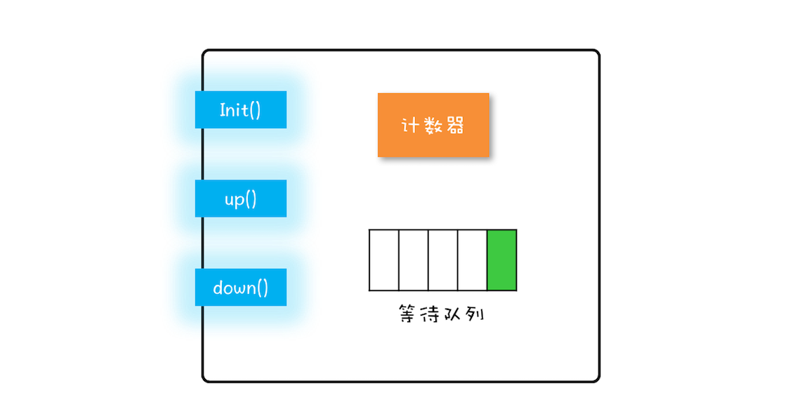

# Semaphore:如何快速实现一个限流器

Semaphore，普遍翻译为"信号量"，我们先介绍信号量模型，之后介绍如何使用，然后在用信号量来实现一个限流器。

## 信号量模型

信号量模型简单的概括为：**一个计数器，一个等待队列，三个方法**。在信号量模型里，计数器和等待队列对外是透明的，所以只能通过信号量模型提供的三个方法来访问他们，这三个方法分别是init()、down()和up()。你可以结合下图形象化地理解。



这三个方法详细的语义具体如下所示。

> - init()：设置计数器的初始值。
> - down()：计数器的值减1；如果此时计数器的值小于0，则当前线程将被阻塞，否则当前线程可以继续执行。
> - up()：计数器的值加1；如果此时计数器的值小于或者等于0，则唤醒等待队列中的一个线程，并将其从等待队列中移除。

这里提到的init()、down()和up()三个方法都是原子性的，并且这个原子性是由信号量模型的实现方保证的。在Java SDK里面，信号量模型是由java.util.concurrent.Semaphore实现的，Semaphore这个类能够保证这三个方法都是原子操作。

大家可以参照下面代码化的信号量模型。

```java
class Semaphore{
  // 计数器
  int count;
  // 等待队列
  Queue queue;
  // 初始化操作
  Semaphore(int c){
    this.count=c;
  }
  // 
  void down(){
    this.count--;
    if(this.count<0){
      // 将当前线程插入等待队列
      // 阻塞当前线程
    }
  }
  void up(){
    this.count++;
    if(this.count<=0) {
      // 移除等待队列中的某个线程 T
      // 唤醒线程 T
    }
  }
}

```

有同学认为up()中的判断条件应该>=0，我觉得有可能理解为生产者-消费者模式中的生产者了。可以这么想，>0就意味着没有阻塞的线程了，所以只有<=0的情况才需要唤醒一个等待的线程。其实down()和up()是成对出现的，并且是先调用down()获得锁，处理完成再调用up()释放锁，如果信号量初始值为1，应该是不会出现>0的情况的，除非故意调先用up()，这也失去了信号量本身的意义了。

信号量模型里面，down()、up()这两个操作历史上最早乘坐P操作和V操作，所以信号量模型也被成为PV原语。在Java SDK并发包里，down()和up()对应的是acquire()和release()。

## 如何使用信号量

通过上文，我们返现信号量的模型还是很简单的，那具体该如何使用呢？其实你想想饭店等位子就可以了。当人少的时候大家都有位子可以吃饭，当位子坐满了的时候，大家就要取号排队了，门口的喊号的小哥就是信号量，小哥控制能否较好，得益于一个关键规则：在叫好之前得先确认有位子空出来，然后才能进人。这个规则和我们前面提到的锁的规则是不是很类似？

其实，信号量的使用也是类似的。这里我们还是用累加器的例子来说明信号量的使用。在累加器的例子里面，count += 1操作是个临界区，只允许一个线程执行，也就是说要保证互斥。那这种情况用信号量怎么控制呢？

其实很简单，就像我们用互斥锁一样，只需要进入临界区之前执行以下down()操作，退出临界区之前执行以下up()操作就可以了。下面的Java代码的实力，acquire()就是信号量里的down()操作，release()就是信号量里的up()操作。

```java
static int count;
// 初始化信号量
static final Semaphore s 
    = new Semaphore(1);
// 用信号量保证互斥    
static void addOne() {
  s.acquire();
  try {
    count+=1;
  } finally {
    s.release();
  }
}

```
我们来分析下，信号量是如何保证互斥的。假设两个线程T1和T2同时访问addOne()方法，当它们同事调用acquire()的时候，由于acquire()是一个原子操作，所以只能有一个线程（假设T1）把信号量里的计数器减为0，另外一个线程（T2）则是将计数器减为-1。对于线程T1，信号量里面的计数器的值是0，大于等于0，所以线程T1会继续执行；对于线程T2，信号量里面的计数器的值是-1，小于0，按照信号量模型里对down()操作的描述，线程T2将被阻塞。所以此时只有线程T1会进入临界区执行count+=1;.

当线程T1执行release()操作，也就是up()操作的时候，信号量里的计数器的值是-1，加1之后的值是0，小于等于0，按照信号量模型里对up()操作的描述，此时等待队列中的T2将被唤醒。于是T2在T1执行完临界区代码之后才获得了进入临界区执行的机会，从而保证了互斥性。

## 快速实现一个限流器


