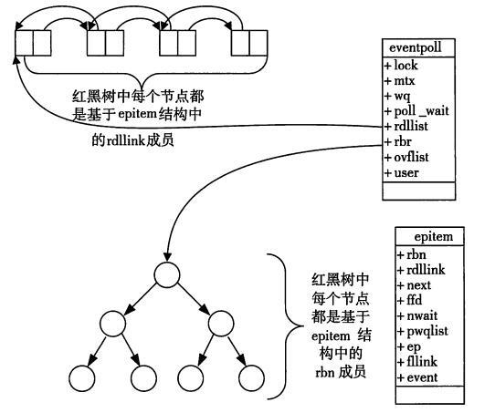

# epoll

## 为什么epoll这么快

- epoll的设计和实现与select完全不同。epoll通过在Linux内核中申请一个简易的文件系统(文件系统一般用什么数据结构实现？B+树)。
- epoll把原来的select/poll调用分成了3个部分：
	- epoll_create()系统调用。此调用返回一个句柄，之后所有的使用都依靠这个句柄来标识。
	- epoll_ctl()系统调用。通过此调用向epoll对象中添加、删除、修改感兴趣的事件，返回0标识成功，返回-1表示失败。
	- epoll_wait()系统调用。通过此调用收集收集在epoll监控中已经发生的事件。

**通过红黑树和双链表数据结构，并结合回调机制，造就了epoll的高效。**

## select与poll机制

- select机制
	- 注册套接字到相关的集合（使用FD_SET）
	- select()轮循检测是否有套接字就绪
	- 循环所有的注册的套接字检查是否是select()返回中的就绪套接字(使用FD_ISSET)

- poll机制
	- 设置pollfd结构
	- poll轮循检测就绪套接字
	- 循环所有的结构的revent检查是否发生事件