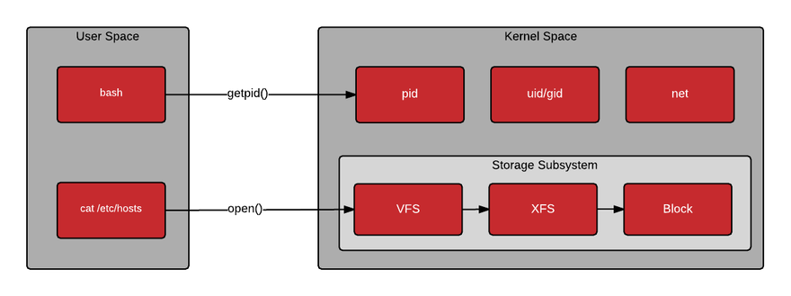

# 用户空间和内核空间		

## 用户空间

**只能执行简单的运算，不能直接调用系统资源，必须通过系统接口（又称 system call），才能向内核发出指令。**

## 内核空间

 **可以执行任意命令，调用系统的一切资源。**

- 如果想查看单个程序的耗时，一般使用time命令。
	
		程序名之前加上time命令，会在程序执行完毕以后，默认显示三行统计。
		real：程序从开始运行到结束的全部时间，这是用户能感知到的时间，包括 CPU 切换去执行其他任务的时间。
		user：程序在 User space 执行的时间
		sys：程序在 Kernel space 执行的时间

!> user和sys之和，一般情况下，应该小于real。但如果是多核 CPU，这两个指标反映的是所有 CPU 的总耗时，所以它们之和可能大于real。