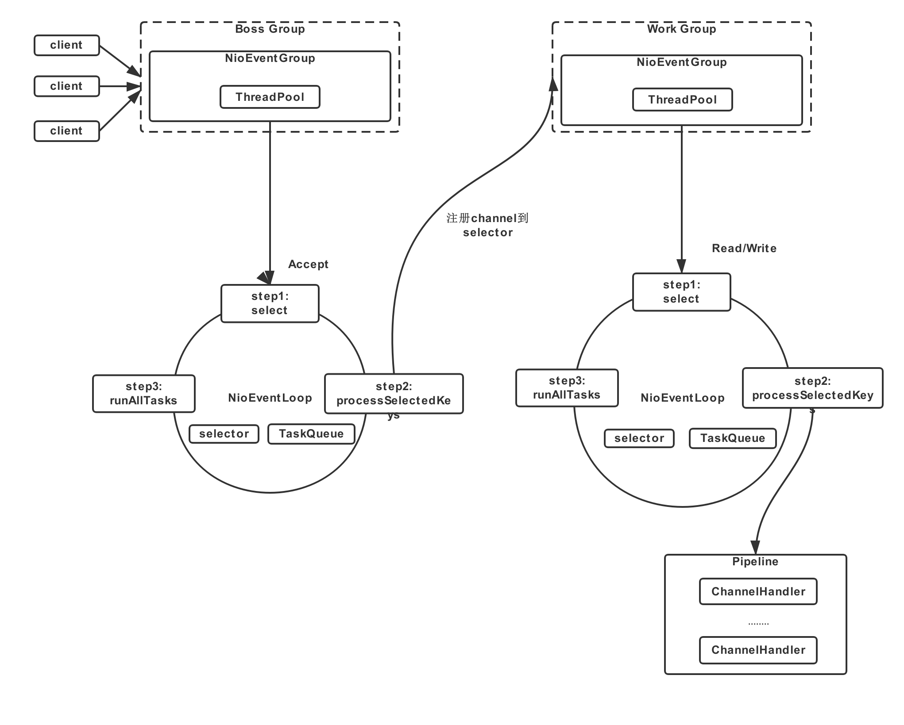

# Netty

> Netty是 一个异步事件驱动的网络应用程序框架，用于快速开发可维护的高性能协议服务器和客户端。

## Netty解决了什么问题
    Java原生NIO API 使用复杂，且有空轮训Bug，使用原生API时不能完全将精力集中在业务逻辑上。
    Netty是JBoss提供的一个异步的，事件驱动的网络框架，可以快速开发高性能、高可用性的网络服务器和客户端程序
    
## Netty特点

- 依赖关系简单
- 吞吐量高，延迟低，资源消耗少
- 使用安全，支持SSL/TLS和StartTLS
- 社区活跃

## Netty结构

### Netty核心部分
    提供了零拷贝的ByteBuffer，提升了IO性能，
    一套抽象的通讯层API，和可扩展的事件模型。

### Netty传输层
    提供了网络传输的一些实现

### Netty支持的协议
    包括常见的Http，Google Protobuf等协议
    
## Netty线程模型

    BossGroup通过轮询Selector，将事件推给WorkGroup，
    WorkGroup执行对应的Pipline

