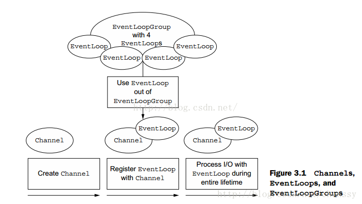

# Netty的核心组件

## Channel

> Channel是Netty中的网络抽象类，包含了基本的IO操作。Netty的Channel提供了一系列的API，降低了操作Socket的复杂性。

- 在 Channel 接口层，采用 Facade 模式进行统一封装，将网络 I/O 操作、网络 I/O 相关联的其他操作封装起来，统一对外提供。
- Channel 接口的定义尽量大而全，为 SocketChannel 和 ServerSocketChannel 提供统一的视图，由不同子类实现不同的功能，公共功能在抽象父类中实现，最大程度地实现功能和接口的重用。
- 具体实现采用聚合而非包含的方式，将相关的功能类聚合在 Channel 中，有 Channel 统一负责和调度，功能实现更加灵活。

## ChannelFuture

> Netty 为异步非阻塞，即所有的 I/O 操作都为异步的，因此，我们不能立刻得知消息是否已经被处理了。Netty 提供了 ChannelFuture 接口，通过该接口的 addListener() 方法注册一个 ChannelFutureListener，当操作执行成功或者失败时，监听就会自动触发返回结果。

## EventLoop

> Netty 基于事件驱动模型，使用不同的事件来通知我们状态的改变或者操作状态的改变。它定义了在整个连接的生命周期里当有事件发生的时候处理的核心抽象。

- Channel、EventLoop、Thread、EventLoopGroup之间的关系

- 一个EventLoopGroup 包含一个或多个 EventLoop。
- 一个EventLoop 在它的生命周期内只能与一个Thread绑定。
- 所有有 EnventLoop 处理的 I/O 事件都将在它专有的 Thread 上被处理。
- 一个Channel 在它的生命周期内只能注册与一个 EventLoop。
- 一个EventLoop 可被分配至一个或多个 Channel 。

## ChannelHandler

## ChannelPipeline